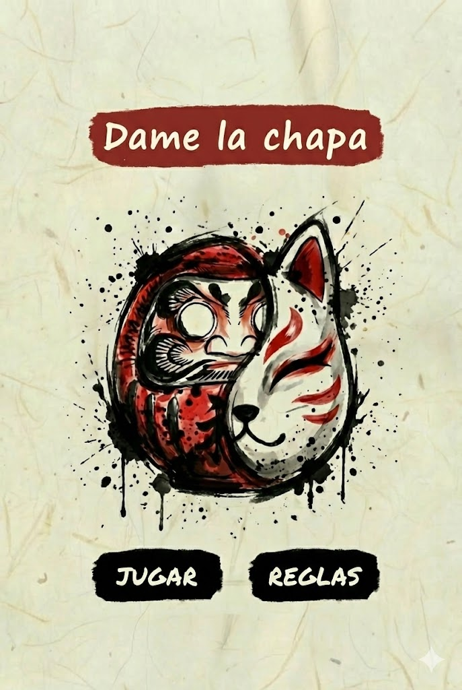

# 🏮 Dame la Chapa: Zeni Hajiki Digital

> **Una reinterpretación digital del clásico juego japonés Zeni Hajiki (銭弾き) con estética Sumi-e.**

  

## 📖 Sobre el Proyecto

**Dame la Chapa** busca capturar la serenidad del arte tradicional japonés y la tensión estratégica de un duelo físico. A diferencia de los juegos móviles frenéticos actuales, este proyecto ofrece una experiencia "Zen", local y táctil.

Desarrollado **100% en Android Nativo (Kotlin)**, utilizando `Canvas` y `SurfaceView` para crear un **motor de físicas 2D artesanal** desde cero, sin depender de librerías externas ni motores de juegos como Unity.

---

## 📸 Galería

| **El Tablero de Juego** | **Victoria y Derrota (Wireframe)** |
|:-----------------------:|:---------------------:|
|  |  |
| *Interfaz limpia con marcadores y físicas en tiempo real* | *Prototipo pantalla final del juego feedback visual estilo Sumi-e* |

---

## 🎮 Reglas del Juego (Game Rules)

El juego se basa en la mecánica tradicional de "chapas" o monedas, adaptada a una pantalla táctil.

### 1. Objetivo
El objetivo es sencillo pero estratégico: **Expulsar todas las fichas del oponente fuera del círculo de juego (Dohyo).**

### 2. Mecánica de Turnos
* Partida para **2 Jugadores** en el mismo dispositivo (Multijugador Local).
* **Jugador 1 (Rojo):** Controla las fichas **Daruma** (símbolo de perseverancia).
* **Jugador 2 (Blanco):** Controla las fichas **Kitsune/Inari** (símbolo de astucia).
* Los turnos son alternos. El HUD indicará claramente a quién le toca jugar.

### 3. Controles (Física y Habilidad)
* **Apuntar:** Toca tu ficha y arrastra el dedo en la dirección opuesta a donde quieres lanzar (mecanismo "tirachinas").
* **Fuerza:** Cuanto más estires el arrastre, mayor será la fuerza del impacto.
* **Colisiones:** Las fichas tienen masa y fricción. Al chocar, transfieren energía cinética de forma elástica. ¡Usa las fichas del rival para posicionarte o sacarlas!

### 4. Victoria
El primer jugador que logre dejar el tablero libre de fichas enemigas gana la partida y recibe la bendición del Daruma.

---

## 🛠️ Stack Tecnológico

Este proyecto es una demostración de capacidades técnicas en el desarrollo Android puro:

* **Lenguaje:** Kotlin.
* **Gráficos:** `android.graphics.Canvas` & `Paint` (Renderizado manual).
* **Game Loop:** Implementación propia usando `SurfaceView` y gestión de hilos (`GameThread`) para mantener 60 FPS estables.
* **Físicas:** Motor vectorial propio para:
    * Detección de colisiones circulares.
    * Cálculo de rebotes elásticos.
    * Fricción y desaceleración (frenado natural).
* **Arquitectura:** MVVM simplificado para gestión de estados de juego.

---

## 🗺️ Roadmap y Estado

El proyecto se encuentra en la **Fase 4 (Seguimiento y Ejecución)**.

- [x] **Fase 1 & 2:** Análisis, Diseño UML y Prototipado (Wireframes/Mockups).
- [x] **Core:** Motor de físicas funcional (rebotes y movimiento).
- [x] **UI:** Menú principal y HUD responsive implementados.
- [ ] **Optimización:** Reducción de 10 a 5 fichas por jugador para mejorar la jugabilidad.
- [ ] **UX:** Pantalla de reglas simplificada al inicio.
- [ ] **Audio:** Integración final de efectos de sonido (choques, victoria).
- [ ] **Release:** Generación de APK final y documentación técnica.

---

## ✒️ Autor

**María Josefa Castro Rivero**
* Desarrollo de Aplicaciones Multiplataforma (DAM)
* [GitHub Profile](https://github.com/river0e)

---
*Este proyecto fue creado con fines educativos para demostrar el potencial de Android Canvas API.*
